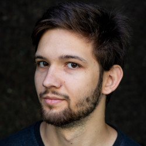

{{Title}}

# About Me

Hi, I'm Georg Marth, a Unity and general game programmer from Berlin. I made this site to present myself and my work. I studied computer science in Magdeburg for three years. Later I went to GPB Berlin to learn game design and game specific programming. Right now I am looking for an internship for 6 months in game related programming. If you are interested, please contact me via [mailto:marth.georg@gmail.com](email).

# Portfolio

These are some projects that I worked on by myself or at school.

## Duel Magic

A two-player splitscreen fighting game where you shoot your opponent with magic.  
I created this game for my intermediate exam at GPB Berlin. 

## Rubiks Cube Game

Solve different virtual Rubiks cubes. You have the choice between 4 different cubes and the game shuffles them randomly with the specified amount. You can set a time limit for you to solve or just let the timer run up. The game also checks if the cube is solved and celebrates for you!

# Global Game Jam

I participated in two global game jams and these are the games I worked on.

## Always on Static

[Link to Global Game Jam game site](https://globalgamejam.org/2018/games/always-static)

I made my first hacked together network multiplayer game in 2018s global game jam. The theme for the jam was 'transmission'. In this asymmetrical game you either play as someone on the roof trying to adjust an antenna or as the person in the living room streaming a videogame. The two people must work together and communicate via cell phone message icons.  
There are two different game clients, one done in Unity, the other written from scratch in C++.  
I was responsible for the programming part of the unity client.
The code for the unity side of things can be found at my [GGJ2018 repository](https://github.com/georgmarth/GGJ2018).

## What Remains of Gone Home

[Link to Global Game Jam game site Site](https://globalgamejam.org/2019/games/what-remains-gone-home)

In the global game jam 2019 I was more involved in modeling and game design than actual programming.
The theme to this years jam was 'What home means to you'. Our game was called 'What remains of Gone Home' and was a music and narration focused game. Details about the project can be found on the jam site and on [github](https://github.com/tobiasbruch/GGJ_2019).

# Personal 

Although I am foremost a programmer, I have an interest in many different fields and disciplines.  
I can do 3D modeling in Blender3D and know my way around Photoshop and Substance Painter. I also have experience recording and mixing audio with professional hardware.  
I play the violin, guitar and bass as a hobby and used to do so professionally in a folk band.  

# Links

**E-mail: [marth.georg@gmail.com](mailto:marth.georg@gmail.com)**  
**github: [github.com/georgmarth](https://github.com/georgmarth)**  
**Twitter: [@Voldepreuss](https://twitter.com/voldepreuss)**  
**Sketchfab: [Voldepreuss](https://sketchfab.com/Voldepreuss)**  